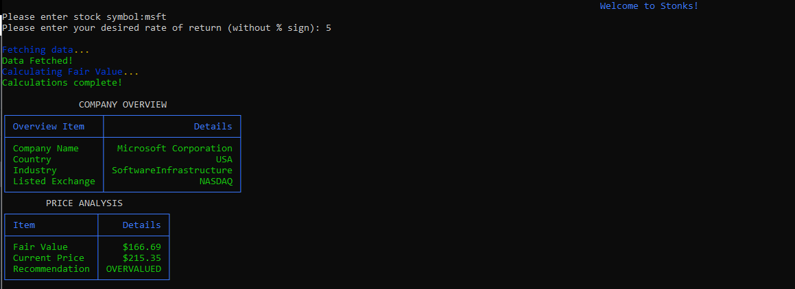

# stonks
Stonks is an application that will automate an existing stock valuation method that is widely used in value investing.
###### The method used by this program is outlined in this video by 'New Money': https://www.youtube.com/watch?v=ICiwzpQDGCI&ab_channel=NewMoney

### Packages Required
Use your package manager to install the following. <br/>
###### The examples provided use the pip package manager.

```
pip install requests
pip install alpha_vantage
pip install rich
pip install pandas
```

### Setup
You will need an API Key from Alpha Vantage to use this program. For basic usage, you can get a free API Key.
###### Visit https://www.alphavantage.co/ to get your API Key.

* Add your Alpha Vantage API key to `api_key.txt` within the quotations.
* Run `stonks.py` on your python interpreter and automate the given stock valuation process!

### Basic Usage and Output
Upon running `stonks.py`, below is a sample of basic usage of the program and sample output. <br/>
###### In this example, MSFT is the ticker of the stock and the desired rate of return is 5% p.a. The fair value of the stock is based upon the rate of return you expect.


### References
Stock valuation approach: https://www.youtube.com/watch?v=ICiwzpQDGCI&ab_channel=NewMoney <br/>
Requests API: https://requests.readthedocs.io/en/master/ <br/>
Alpha Vantage API: https://www.alphavantage.co/ <br/>
Alpha_Vantage API Wrapper: https://github.com/RomelTorres/alpha_vantage/tree/develop/alpha_vantage <br/>
Rich: https://github.com/willmcgugan/rich <br/>
